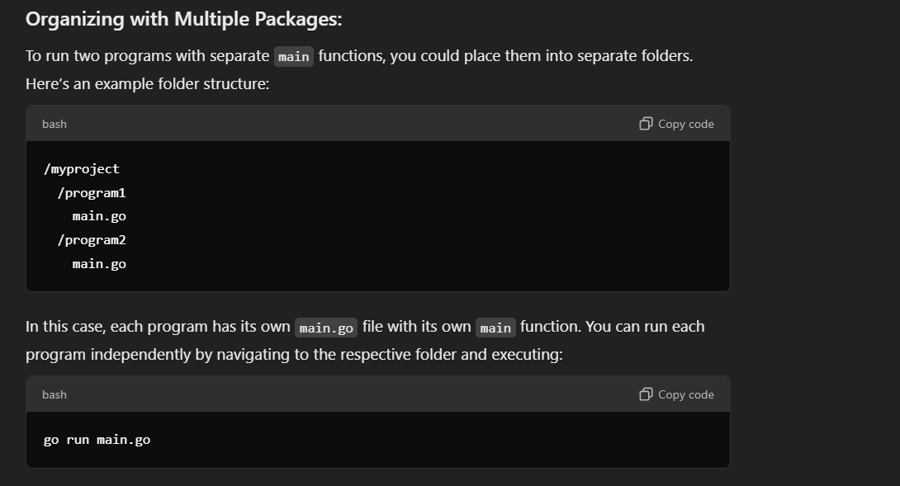
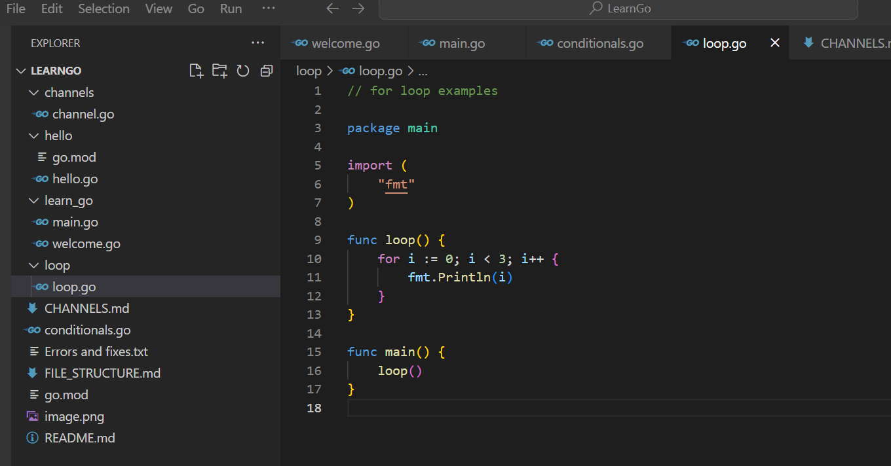

In Go, all function calls must be within a function (typically within main for the main execution flow).

After separating each go script into separate folders

Have package main at the start of script

Have a main function inside the go script and call the function(s) from main function inside the script

